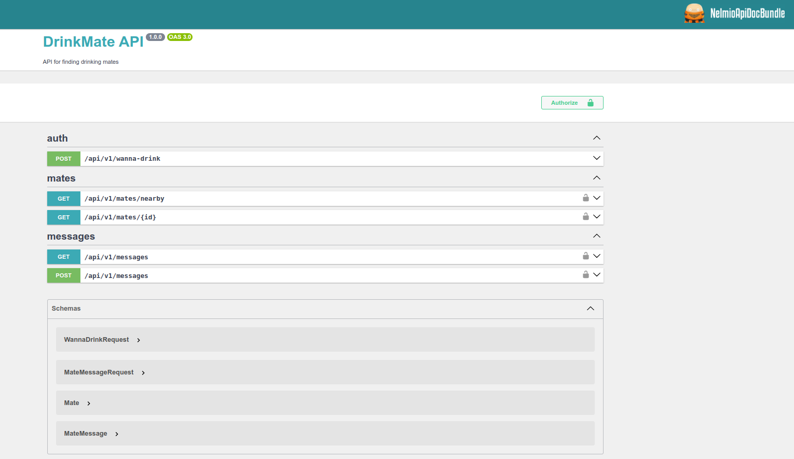

[](https://github.com/msobin/drink-mate/graphs/contributors)
[](https://github.com/msobin/drink-mate/network/members)
[](https://github.com/msobin/drink-mate/stargazers)
[](https://img.shields.io/github/issues/msobin/drink-mate.svg?style=for-the-badge)
[]( https://github.com/msobin/drink-mate/blob/master/LICENSE.txt)
[](https://linkedin.com/in/maximsobin)

<div align="center">
    <a href="https://github.com/msobin/drink-mate">
        
    </a>
</div>
<br><br>
<details>
    <summary>Screenshot</summary>
    
</details>

## About The Project
Your go-to solution for finding the perfect drinking buddy!
Whether you're looking to share a pint with someone new or find a local companion for happy hour, DrinkingMate API has got you covered.
Simply register, mark yourself as ready to clink glasses, and discover like-minded revelers in your area.
No more lonely nights at the bar – with DrinkingMate API, you're just a tap away from turning strangers into friends over a drink (or two).
Cheers to new connections and unforgettable nights!

*The project is still in development and some features may not be fully implemented.*

### Built With
* PHP (Symfony)
* JS (Vue.js)
* PostgreSQL
* Docker

### Requirements
* [Docker](https://www.docker.com/)
* Docker-compose (comes with Docker)
* [Task](https://taskfile.dev/) (task runner)

### Installation

Clone the repo
   ```sh
    git clone git@github.com:msobin/drink-mate.git
   ```
Run the following command in project directory to start the project
   ```sh
    task up
   ```
Open your browser and navigate to http://localhost:80/api/v1/doc

*The ports used can be overridden by creating a docker-compose.override.yaml file with the following contents:*
```yaml
version: '3'

services:
  nginx:
    ports: !override
      - "8080:80"
  postgres:
    ports: !override
      - "54321:5432"
  rabbitmq:
    ports: !override
      - "15673:15672"
```

### Usage

API Specification can be found at http://localhost:80/api/v1/doc

Additionally, you can use the built-in demo client. Open the URL http://localhost/demo in two (or more) tabs, select a point on the map, modify the name and description fields if necessary, and click the 'Wanna drink!' button. Points located within a distance of <= 1 km will be visible to each other on the map for one hour (token lifetime).

