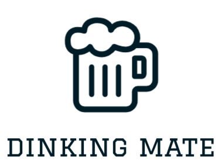

  

<h3 align="center">DrinkingMate API</h3>

## About The Project
Your go-to solution for finding the perfect drinking buddy!
Whether you're looking to share a pint with someone new or find a local companion for happy hour, DrinkingMate API has got you covered.
Simply register, mark yourself as ready to clink glasses, and discover like-minded revelers in your area.
No more lonely nights at the bar – with DrinkingMate API, you're just a tap away from turning strangers into friends over a drink (or two).
Cheers to new connections and unforgettable nights!

### Built With
* 
* 
* 
* 

### Prerequisites
* Docker
* Task (https://taskfile.dev/)

### Installation

Will be added soon

## Usage

Will be added soon
